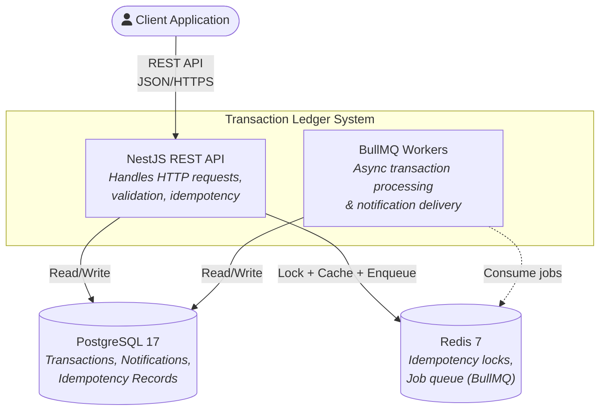
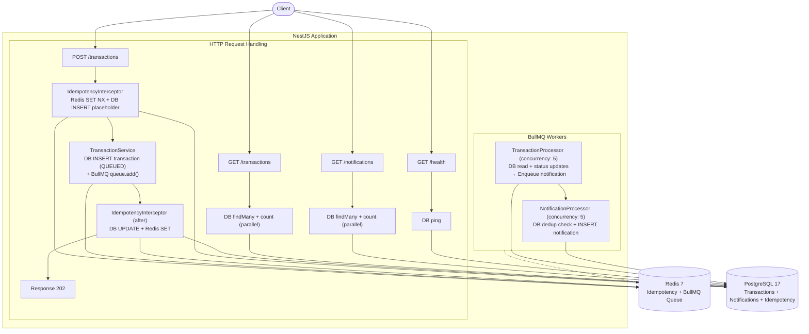
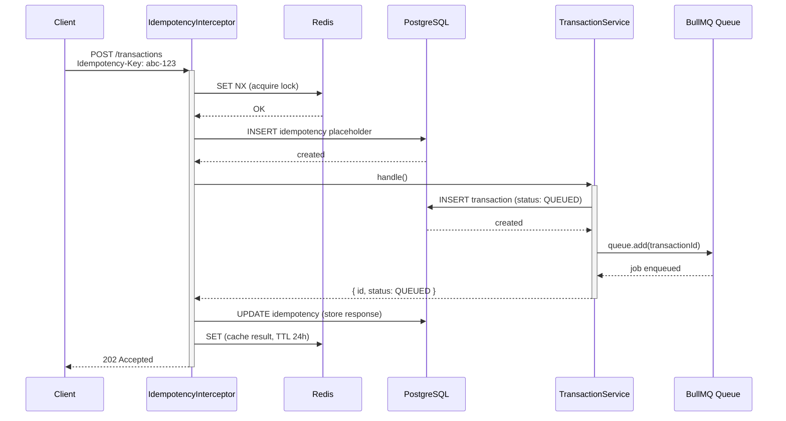
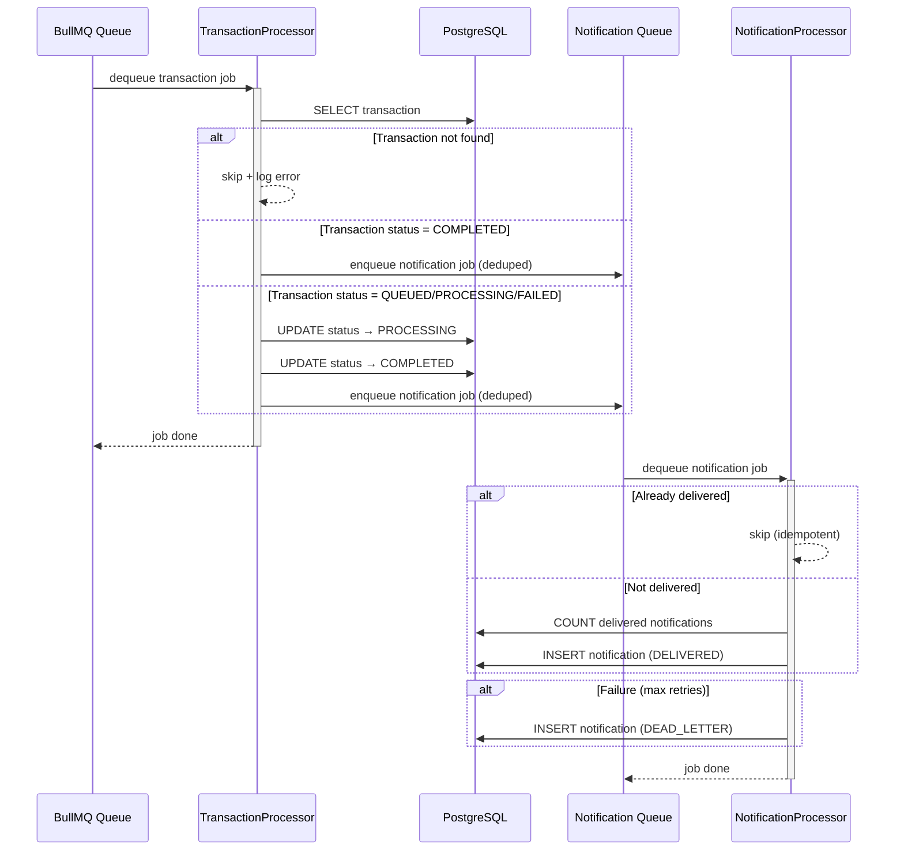
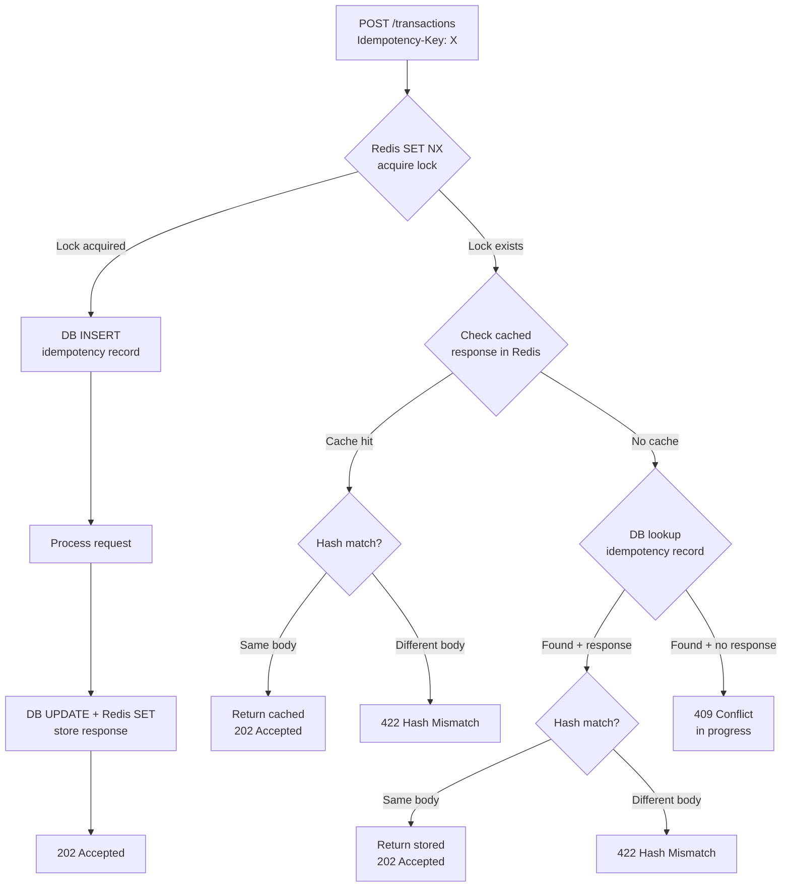
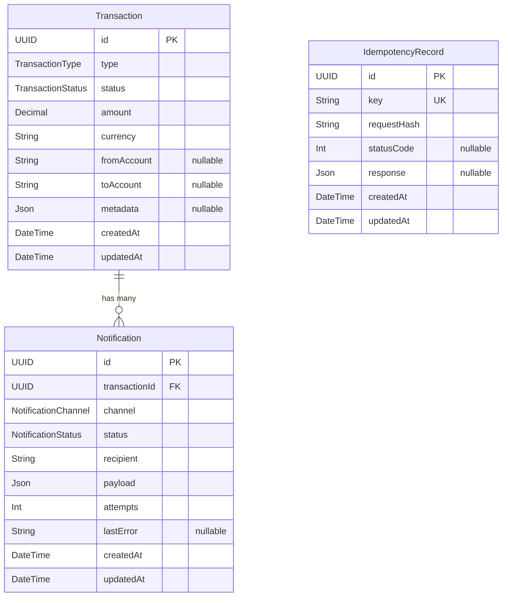

# Architecture

High-level architecture in this document is verified against the current codebase. Capacity sizing and infrastructure estimates live in `docs/SYSTEM-DESIGN.md`.

## Overview

## Detailed Component Diagram

## Write Path (POST /transactions)

### 6 High-Level Application Steps

1. Redis `SET NX` — acquire idempotency lock
2. PostgreSQL `INSERT` — create idempotency placeholder
3. PostgreSQL `INSERT` — create transaction record (status: QUEUED)
4. BullMQ `queue.add()` — enqueue Redis-backed job
5. PostgreSQL `UPDATE` — store response in idempotency record
6. Redis `SET` — cache idempotency result

Returns `202 Accepted` with `{ id, status: "QUEUED" }`.

BullMQ enqueueing expands into multiple Redis commands internally. The list above stays at the application-flow level rather than claiming an exact Redis command trace.

### Sequence Diagram

### Read Path (GET /transactions) — 2 parallel I/O ops

1. PostgreSQL `SELECT` — findMany with filters + pagination
2. PostgreSQL `SELECT` — count total records

## Background Processing

- **TransactionProcessor** (concurrency: 5): Loads the transaction, short-circuits missing/already-completed jobs, updates QUEUED/PROCESSING/FAILED → COMPLETED, then enqueues a notification with deterministic deduplication
- **NotificationProcessor** (concurrency: 5): Checks for an existing delivered notification, creates DELIVERED on success, or creates DEAD_LETTER after retries are exhausted

## Idempotency

| Scenario | Response |
|----------|----------|
| New key | `202` — transaction queued |
| Same key + same body | `202` — cached response returned |
| Same key + different body | `422` — hash mismatch |
| Key in progress (concurrent) | `409` — conflict |

### Interceptor vs Service

**IdempotencyInterceptor** (request-level): Extracts `Idempotency-Key` header, computes SHA256 hash of request body, delegates to service for lock/cache logic, stores response after handler completes, releases lock on error.

**IdempotencyService** (logic-level): `checkAndAcquire()` atomic Redis SET NX + DB placeholder, `store()` DB update + Redis cache, `release()` cleanup on failure, `inspectExisting()` check state from Redis/DB, handles stale placeholders (>60s auto-cleanup).

## Database Schema

### Enums

| Enum | Values |
|------|--------|
| TransactionType | `DEPOSIT` `WITHDRAWAL` `TRANSFER` `REFUND` |
| TransactionStatus | `QUEUED` `PROCESSING` `COMPLETED` `FAILED` |
| NotificationChannel | `EMAIL` `SMS` `PUSH` `WEBHOOK` |
| NotificationStatus | `PENDING` `PROCESSING` `DELIVERED` `FAILED` `DEAD_LETTER` |
