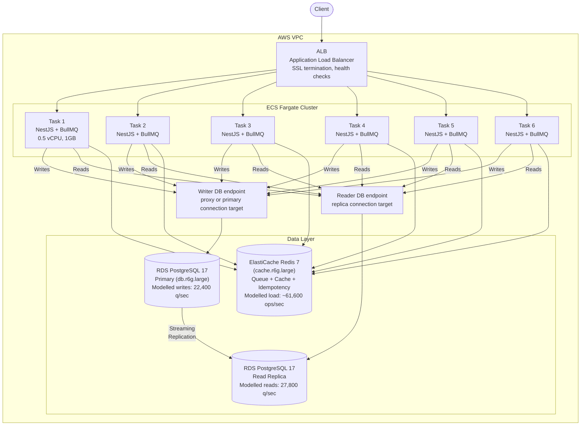
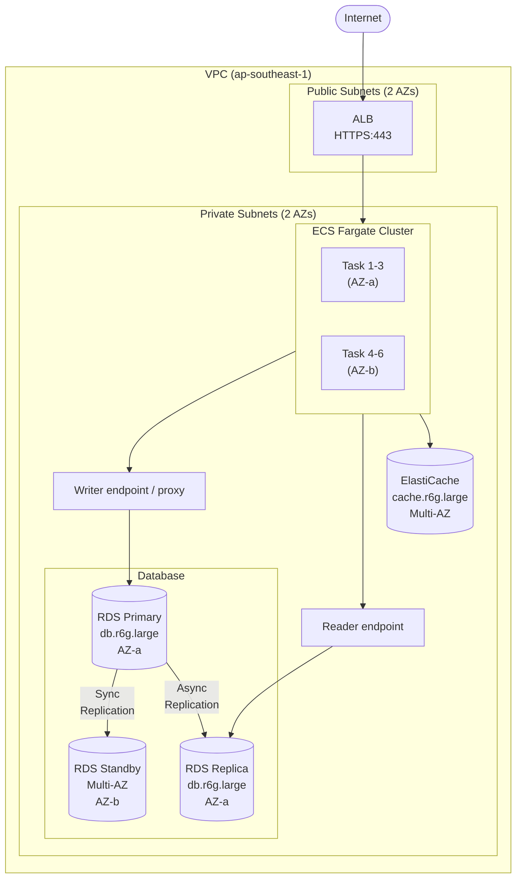

# System Design — Transaction Ledger System

> This document mixes two kinds of information:
> 1. code-verified behavior from the current repo (request flows, queue topology, config defaults, stress-test scenario definitions)
> 2. target-state design estimates for a 100K-concurrent-user deployment (capacity math, AWS sizing, costs, mitigations)
>
> Benchmark figures below are taken from the summaries in [stress-tests/STRESS-TEST.md](../stress-tests/STRESS-TEST.md). Raw k6 result artifacts are not committed in this repo.

## Table of Contents

- [1. Measured Baseline](#1-measured-baseline)
- [2. Capacity Model for 100K Concurrent Users](#2-capacity-model-for-100k-concurrent-users)
- [3. Bottleneck Analysis](#3-bottleneck-analysis)
- [4. Architecture](#4-architecture)
- [5. Failure Mode Analysis](#5-failure-mode-analysis)
- [6. Recommended Observability](#6-recommended-observability)
- [7. AWS Infrastructure](#7-aws-infrastructure)
- [8. Scaling Roadmap](#8-scaling-roadmap)

---

## 1. Measured Baseline

### I/O Profile per Operation

Traced from actual application code paths. PostgreSQL query counts below are exact at the application layer; BullMQ Redis command counts are approximate because enqueue/worker internals expand into multiple Redis operations that are not captured as committed traces in this repo.

#### Write Path — HTTP Request (POST /transactions)

| Step | Source | Operation | Type |
|------|--------|-----------|------|
| 1 | `IdempotencyService.checkAndAcquire()` | `redis.setNX()` — acquire lock | Redis |
| 2 | `IdempotencyService.checkAndAcquire()` | `prisma.idempotencyRecord.create()` — placeholder | PG |
| 3 | `TransactionService.createTransaction()` | `prisma.transaction.create()` — persist QUEUED | PG |
| 4–8 | `TransactionService.createTransaction()` | `queue.add()` — BullMQ enqueue path (exact internal commands depend on BullMQ version/config) | ~5× Redis |
| 9 | `IdempotencyService.store()` | `prisma.idempotencyRecord.update()` — store response | PG |
| 10 | `IdempotencyService.store()` | `redis.set()` — cache result | Redis |

**Approx. total: ~7 Redis ops + 3 PG queries = ~10 I/O operations per write request**

#### Write Path — Background Job (TransactionProcessor)

| Step | Source | Operation | Type |
|------|--------|-----------|------|
| 1–5 | BullMQ worker internals | dequeue/ack/state-management commands | ~5× Redis |
| 6 | `TransactionProcessor.process()` | `prisma.transaction.findUnique()` — guard | PG |
| 7 | `TransactionProcessor.process()` | `prisma.transaction.updateMany()` → PROCESSING | PG |
| 8 | `TransactionProcessor.process()` | `prisma.transaction.update()` → COMPLETED | PG |
| 9–13 | `TransactionProcessor.enqueueNotification()` | `notificationQueue.add()` — BullMQ enqueue path | ~5× Redis |

**Approx. total: ~10 Redis ops + 3 PG queries**

#### Write Path — Notification Job (NotificationProcessor)

| Step | Source | Operation | Type |
|------|--------|-----------|------|
| 1–5 | BullMQ worker internals | dequeue/ack/state-management commands | ~5× Redis |
| 6 | `NotificationProcessor.process()` | `prisma.notification.count()` — dedup guard | PG |
| 7 | `NotificationProcessor.process()` | `prisma.notification.create()` — persist | PG |

**Approx. total: ~5 Redis ops + 2 PG queries**

#### Read Path (GET /transactions)

| Step | Source | Operation | Type |
|------|--------|-----------|------|
| 1 | `TransactionService.findAll()` | `prisma.transaction.findMany()` | PG |
| 2 | `TransactionService.findAll()` | `prisma.transaction.count()` | PG |

**Total: 0 Redis ops + 2 PG queries** (both run in parallel via `Promise.all`)

#### I/O Summary per Write Transaction (full lifecycle)

| Layer | HTTP | Background | Notification | Total |
|-------|-----:|----------:|-------------:|------:|
| PG queries | 3 | 3 | 2 | **8** |
| Redis ops | ~7 | ~10 | ~5 | **~22** |

One user-facing write request triggers 8 PG queries and roughly 22 Redis operations across its full lifecycle when BullMQ internals are included.

### Benchmark Results (k6, single process)

From stress-tests on local Docker (PG 17 on tmpfs, Redis 7 no persistence, single NestJS process):

| Scenario | Target RPS | Achieved RPS | Avg Latency | p95 Latency | Error Rate |
|----------|----------:|-------------:|------------:|------------:|-----------:|
| Write-only | 2,000 | ~2,000 | 3.68ms | 5.13ms | 0% |
| Load (write+read) | 1,200 | 911 avg* | 44ms | 44ms | 0% |
| Stress (write+read) | 2,500 | 884 avg* | 219ms | 219ms | 0% |
| Spike (burst 2K) | 2,000 peak | 292 avg* | 863ms | 863ms | 0% |

\* Averages include ramp-up/cooldown phases. Sustained peak is higher — see STRESS-TEST.md for details.

**Documented observation from the benchmark summary**: At 150 VUs → 2,600 RPS total. At 320 VUs → still 2,600 RPS (throughput flat, latency doubled). This strongly suggests event loop saturation on a single process.

### Multi-Worker Scaling

The repo includes native cluster mode in [`src/cluster.ts`](../src/cluster.ts), but it does not include committed multi-worker benchmark artifacts or a PM2 config. Because of that, precise scaling-efficiency numbers are not reproducible from the repository alone.

What can be verified from code:
- each process creates its own `pg.Pool` in `PrismaService`
- pool size defaults to `DB_POOL_SIZE=20`
- cluster mode and horizontal scaling multiply pool count linearly by worker/task count

Operational implication: multi-process or multi-node scaling should be treated as connection-sensitive and re-benchmarked on the target infrastructure.

---

## 2. Capacity Model for 100K Concurrent Users

### Traffic Assumptions

| Parameter | Value | Rationale |
|-----------|------:|-----------|
| Concurrent users | 100,000 | Target |
| Requests/user/min | 10 | Mix of writes + reads + polling |
| Total RPS | **16,700** | 100K × 10 / 60 |
| Write:Read ratio | 1:5 | Typical for ledger (1 write, 5 reads/polls) |
| Write RPS | **2,800** | 16,700 / 6 |
| Read RPS | **13,900** | 16,700 × 5/6 |

### I/O Load Projection

Using the code-path model from Section 1:

| Operation | RPS | PG queries/req | Redis ops/req | Total PG/sec | Total Redis/sec |
|-----------|----:|---------------:|--------------:|-------------:|----------------:|
| Write (HTTP) | 2,800 | 3 | ~7 | 8,400 | ~19,600 |
| Write (background) | 2,800 | 3 | ~10 | 8,400 | ~28,000 |
| Write (notification) | 2,800 | 2 | ~5 | 5,600 | ~14,000 |
| Read (list) | 13,900 | 2 | 0 | 27,800 | 0 |
| **Total** | | | | **50,200** | **~61,600** |

### Connection Math

PostgreSQL connections are a first-order concern because every app process creates its own pool:

```
N tasks or workers × pool_size_per_process = potential client-side connections
```

| Config | Tasks/workers | Pool/process | Potential client-side connections | Operational note |
|--------|--------------:|-------------:|----------------------------------:|------------------|
| Current | 1 | 20 | 20 | Matches current single-process default |
| Naive scale | 6 | 20 | 120 | Connection management becomes a deployment concern |
| Naive scale | 12 | 20 | 240 | Requires validation and likely a proxy/pooler |
| With connection proxy | 6 | 20 | 120 front-side | Backend PG concurrency depends on workload and multiplexing efficiency |
| With connection proxy | 12 | 20 | 240 front-side | Still requires target-infra load testing |

---

## 3. Bottleneck Analysis

Ordered by severity. Some items are code-verified risks; some are target-infrastructure design assumptions that still need dedicated benchmarking.

### 3.1 PG Connection Saturation — CRITICAL

**Evidence from code**: every app process creates its own `pg.Pool` in `PrismaService`, and the default pool size is `DB_POOL_SIZE=20`. Cluster mode or horizontal scaling multiplies that pool count linearly.

**Why it's critical**: This can block horizontal scaling well before CPU becomes the limiting factor, because each extra worker/task adds more concurrent database connections and queue consumers.

**Recommended mitigation**: introduce a connection proxy/pooler such as RDS Proxy or PgBouncer, then re-benchmark on the target infrastructure.
- 6 tasks × 20 connections/process = 120 front-side client connections
- a proxy can smooth backend concurrency and reduce failover pain
- exact backend connection counts depend on workload mix and proxy behavior, so they must be validated empirically

**Trade-off**: a managed proxy adds cost and operational coupling, but it is usually simpler than tuning many app-side pools independently.

### 3.2 Read Load on Primary — HIGH

**Modelled evidence**: 13,900 read RPS × 2 PG queries = 27,800 read queries/sec hitting the primary. That's 55% of projected PG load, all competing with writes for the same connections and I/O.

**Root cause**: All reads go to the primary. `findMany` + `count` on growing tables with ORDER BY creates sequential scan pressure.

**Solution**: Read replica
- Route GET endpoints to replica via Prisma `$extends` or separate read-only client
- Primary handles only writes: 8,400 + 8,400 + 5,600 = 22,400 queries/sec
- Replica handles reads: 27,800 queries/sec

**Trade-off**: Replication lag (typically 10-100ms on RDS). Reads may return slightly stale data. For a ledger system:
- GET /transactions list: stale by 100ms is acceptable (user polls anyway)
- GET /transactions/:id: could return QUEUED when actually COMPLETED — acceptable for async flow
- If strong consistency needed: route by-ID reads to primary, list reads to replica

### 3.3 Event Loop Saturation — MEDIUM

**Benchmark summary evidence**: a single process caps at ~2,000 write RPS in the write-only benchmark. In the mixed benchmark summary, 150 VUs and 320 VUs both produce ~2,600 total RPS while latency rises, which suggests event-loop saturation.

**Root cause**: Node.js runs each process on a single event loop. Each write request coordinates Prisma, Redis, and BullMQ work through that loop.

**Recommended mitigation**: add more processes/tasks, but do not assume linear gains until cluster or multi-task benchmarks are run on the target infrastructure.
- horizontal scaling is still the likely direction because the current repo is single-process by default
- cluster mode already exists in `src/cluster.ts`
- connection limits and queue contention must be validated alongside CPU

**Why ECS over PM2**: See Section 4.

### 3.4 Redis — NOT A BOTTLENECK

**Modelled evidence**: projected Redis volume is ~61,600 ops/sec, and the current workload uses simple queue/cache/idempotency operations.

**Action**: Redis is unlikely to be the first bottleneck, but final sizing still needs target-infra load testing and queue-depth monitoring.

### 3.5 Database Sharding — NOT NEEDED YET

**Current read**: nothing in the repo suggests sharding is the next scaling step. Simpler levers exist first: connection pooling, read replicas, query/index tuning, and better admission control.

**When to revisit**: after those levers are exhausted and target-infra benchmarks show primary-write limits that one PostgreSQL cluster cannot handle comfortably.

---

## 4. Architecture

### Target Architecture (100K concurrent users)



> **Note**: read/write splitting is not implemented in the current repo. The target design requires the app to use distinct writer and reader connection targets, for example via separate Prisma clients or datasource overrides.

### Why ECS Fargate over PM2 Cluster

| Concern | PM2 on EC2 | ECS Fargate |
|---------|-----------|-------------|
| Single point of failure | EC2 instance dies → all workers die | Tasks distributed across AZs |
| Scaling | Manual SSH + `pm2 scale` | Auto-scaling policy on CPU/RPS |
| Deploys | `pm2 reload` — brief connection drops | Rolling update — zero downtime |
| Resource isolation | Workers share memory, one OOM kills all | Each task has isolated memory |
| Monitoring | PM2 metrics + custom CloudWatch agent | Built-in CloudWatch Container Insights |
| Cost at scale | EC2 t3.xlarge always-on ($120/mo) | Pay per task, scale to zero possible |

PM2 is fine for Phase 1 (single node). For 100K users, ECS eliminates the SPOF and enables true horizontal scaling.

### Why NOT Separate Worker Nodes

Background jobs (TransactionProcessor, NotificationProcessor) are I/O-bound, not CPU-bound. Each job does 3 PG queries + Redis ops — the event loop is idle waiting for I/O most of the time.

Separating workers onto dedicated nodes would:
- Double the number of ECS tasks (and cost)
- Double the PG connection count (worsening the #1 bottleneck)
- Probably not be the first scaling win for the current I/O-heavy workload

Keep API + workers co-located in the same process. BullMQ handles job distribution natively across multiple consumers.

### RDS Proxy vs PgBouncer

| Factor | PgBouncer (self-managed) | RDS Proxy (managed) |
|--------|------------------------|---------------------|
| Setup | Deploy + maintain EC2/container | Enable in RDS console |
| Connection multiplexing | Transaction-level pooling | Pin-based multiplexing |
| Failover | Manual reconfiguration | Automatic with RDS Multi-AZ |
| IAM auth | Not supported | Native support |
| Cost | EC2 instance (~$30/mo) | ~$50/mo (based on vCPU) |
| Latency overhead | ~0.5ms | ~1ms |
| Prepared statements | Requires `statement` mode (limited) | Supported with pinning |

**Decision**: RDS Proxy. The $20/mo premium over PgBouncer buys automatic failover integration and zero operational overhead. For a team that doesn't want to manage connection pooler infrastructure, this is the right trade-off.

---

## 5. Failure Mode Analysis

### 5.1 Redis Failure

**Impact**: BullMQ stops processing (queue is in Redis). Idempotency interceptor calls `redis.setNX()` as the first operation — Redis down means this throws, and the request returns 500 before reaching any business logic. There is no PG fallback for the idempotency lock; Redis is a hard dependency on the write path.

**Recommended mitigation**:
- ElastiCache Multi-AZ with automatic failover (~30s switchover)
- BullMQ has built-in reconnection with exponential backoff
- After failover, idempotency self-heals: PG is the durable store, Redis cache repopulates on demand

**Blast radius**: Entire write path returns 500 for ~30s during failover. Read path unaffected (no Redis dependency). Background jobs stall but resume after reconnection.

### 5.2 PG Primary Failure

**Impact**: All writes fail. Background jobs fail (can't update transaction status). Reads from replica continue working.

**Recommended mitigation**:
- RDS Multi-AZ: automatic failover to standby (~60-120s)
- BullMQ retries failed jobs automatically (default 3 attempts with backoff)
- Idempotency records in PG — after failover, retried requests see existing records

**Blast radius**: Write path down for ~2 minutes. Read path continues on replica. Queue backlog builds in Redis during outage, drains after recovery.

### 5.3 Queue Backlog → Redis OOM

**Impact**: If PG is slow (but not down), jobs process slowly → queue depth grows → Redis memory fills → Redis OOM → everything breaks.

**Recommended mitigation**:
- Monitor queue depth (alert at 10,000 pending jobs)
- Add admission control or a circuit breaker before memory is exhausted
- Tune worker concurrency/retries if PG becomes the limiting subsystem
- Prefer `noeviction` for queue safety and shed load before Redis runs out of memory

### 5.4 Cascading Failure (Most Dangerous)

```
Slow PG → jobs process slowly → queue backlog grows
→ Redis memory fills → Redis OOM
→ BullMQ dies → idempotency cache dies
→ All new requests hit PG directly (no cache)
→ PG gets even slower → death spiral
```

**Recommended mitigation chain**:
1. **Early warning**: Alert on PG query latency > 50ms (normal is 3-5ms)
2. **Circuit breaker**: Stop accepting new writes when queue depth > 10,000
3. **Backpressure**: Tune worker concurrency and, if needed, add rate limiting at the queue or ingress layer
4. **Redis protection**: Prefer `noeviction` and fail fast rather than silently evicting queue data
5. **Recovery**: Once PG recovers, drain backlog carefully and verify queue health before reopening the floodgates

---

## 6. Recommended Observability

The current repo does not implement this observability stack yet. The items below are recommended signals for the target deployment.

### Metrics by Bottleneck

| Bottleneck | Metric | Source | Alert Threshold | Why |
|-----------|--------|--------|----------------|-----|
| PG Connections (§3.1) | `db.connections.active` | RDS CloudWatch | > 80% max_connections for 5min | Connection exhaustion imminent |
| PG Connections (§3.1) | `rds_proxy.connections.multiplexed` | RDS Proxy CloudWatch | > 90% max for 5min | Proxy itself saturating |
| Read Load (§3.2) | `db.replica.lag_ms` | RDS CloudWatch | > 500ms for 3min | Reads returning stale data |
| Read Load (§3.2) | `db.replica.read_iops` | RDS CloudWatch | > 80% provisioned IOPS | Replica I/O saturated |
| Event Loop (§3.3) | `nodejs.eventloop.delay_ms` | Custom metric (perf_hooks) | > 100ms for 1min | Event loop blocked |
| Event Loop (§3.3) | `http.request.latency.p95` | ALB CloudWatch | > 500ms for 5min | User-facing degradation |
| Queue Health (§5.3) | `bullmq.queue.depth` | Custom metric | > 10,000 for 3min | Backlog building |
| Queue Health (§5.3) | `bullmq.job.processing_time.p95` | Custom metric | > 5s for 3min | Jobs processing slowly |
| Redis (§3.4) | `redis.memory.used_pct` | ElastiCache CloudWatch | > 80% for 5min | OOM risk |
| Redis (§3.4) | `redis.connections.current` | ElastiCache CloudWatch | > 80% max for 5min | Connection exhaustion |
| Cascading (§5.4) | `http.responses.5xx.rate` | ALB CloudWatch | > 5% for 2min | System degrading |

### Dashboard Layout (ordered by criticality)

```
┌─────────────────────────────────────────────────────────┐
│ Row 1: CRITICAL — PG Connection Health                  │
│ ┌──────────────┐ ┌──────────────┐ ┌──────────────┐      │
│ │ Active PG    │ │ RDS Proxy    │ │ Query Latency│      │
│ │ Connections  │ │ Multiplexing │ │ p95          │      │
│ └──────────────┘ └──────────────┘ └──────────────┘      │
├─────────────────────────────────────────────────────────┤
│ Row 2: HIGH — Read Replica & Queue                      │
│ ┌──────────────┐ ┌──────────────┐ ┌──────────────┐      │
│ │ Replica Lag  │ │ Queue Depth  │ │ Job Process  │      │
│ │ (ms)         │ │ (pending)    │ │ Time p95     │      │
│ └──────────────┘ └──────────────┘ └──────────────┘      │
├─────────────────────────────────────────────────────────┤
│ Row 3: MEDIUM — Application Health                      │
│ ┌──────────────┐ ┌──────────────┐ ┌──────────────┐      │
│ │ Event Loop   │ │ HTTP p95     │ │ Error Rate   │      │
│ │ Delay        │ │ Latency      │ │ (5xx %)      │      │
│ └──────────────┘ └──────────────┘ └──────────────┘      │
├─────────────────────────────────────────────────────────┤
│ Row 4: LOW — Redis & Infrastructure                     │
│ ┌──────────────┐ ┌──────────────┐ ┌──────────────┐      │
│ │ Redis Memory │ │ Redis Ops/s  │ │ ECS Task     │      │
│ │ Usage        │ │              │ │ CPU/Memory   │      │
│ └──────────────┘ └──────────────┘ └──────────────┘      │
└─────────────────────────────────────────────────────────┘
```

### Recommended Logging Strategy

Recommended target state: structured JSON logs to stdout → CloudWatch Logs via Fluent Bit sidecar (ECS pattern).

Current repo status: Nest's default logger writes plain text to stdout; custom metrics and structured log events are not implemented yet.

Key log events tied to failure modes:
- `idempotency.lock.acquired` / `idempotency.cache.hit` — track cache hit ratio
- `transaction.queued` / `transaction.completed` / `transaction.failed` — track processing pipeline
- `bullmq.job.stalled` — early warning for worker issues
- `pg.pool.exhausted` — connection pool at capacity

Retention: 30 days CloudWatch Logs → S3 Glacier (90 days) → delete.

---

## 7. AWS Infrastructure

### Illustrative Resource Sizing

| Resource | Spec | Justification | Est. Monthly Cost |
|----------|------|---------------|------------------:|
| ALB | Application Load Balancer | SSL termination, health checks, distributes to 6 tasks | ~$25 |
| ECS Fargate | 6 tasks × 0.5 vCPU, 1GB | Example starting point for multi-task deployment; validate with infra benchmarks | ~$180 |
| RDS Primary | db.r6g.large (2 vCPU, 16GB) | Example size for the modelled 22,400 write queries/sec | ~$300 |
| RDS Read Replica | db.r6g.large | Example size for the modelled 27,800 read queries/sec | ~$300 |
| RDS Proxy | Default endpoint | Centralize connection management and failover handling | ~$50 |
| ElastiCache | cache.r6g.large (2 vCPU, 13GB) | Starting point for queue + cache + idempotency workload | ~$130 |
| CloudWatch | Logs + 15 custom metrics + alarms | Observability stack from Section 6 | ~$25 |
| S3 | Log archive, lifecycle policy | 90-day retention → Glacier → delete at 365 days | ~$10 |
| **Total** | | | **~$1,020/month** |

These costs are planning estimates only. Re-price them in the target AWS region and validate against actual benchmark data before treating them as commitments.

### Infrastructure Diagram



### Security

- RDS, ElastiCache, RDS Proxy in private subnets (no public access)
- ALB in public subnets with WAF (rate limiting, SQL injection protection)
- ECS tasks use IAM task roles (no hardcoded credentials)
- Secrets (DB password, Redis auth) via AWS Secrets Manager, injected as env vars
- All inter-service traffic within VPC, encrypted in transit (TLS)
- Security groups: least-privilege (ECS → RDS Proxy:5432, ECS → Redis:6379, ALB → ECS:3000)

---

## 8. Scaling Roadmap

### Phase 1: →10K concurrent users (~1,700 RPS)

**Architecture**: Single EC2 + Node.js cluster mode (2-4 workers) + RDS Proxy

| Component | Spec | Cost |
|-----------|------|-----:|
| EC2 | t3.large (2 vCPU, 8GB) | ~$60 |
| RDS | db.t3.medium + RDS Proxy | ~$120 |
| ElastiCache | cache.t3.medium | ~$50 |
| **Total** | | **~$250/month** |

**Key actions**:
- Operationalize and benchmark the existing `src/cluster.ts` entrypoint
- Enable RDS Proxy to prevent connection issues with multiple workers
- Monitor: PG connections, event loop delay, queue depth

### Phase 2: →100K concurrent users (~16,700 RPS) — THIS DOCUMENT

**Architecture**: ALB + ECS Fargate (6 tasks) + RDS Proxy + Read Replica + ElastiCache

**Cost**: ~$1,020/month (see Section 7)

**Key actions**:
- Migrate from EC2 to ECS Fargate
- Add read replica, implement read/write routing in Prisma
- Set up full observability stack (Section 6)
- Implement circuit breaker for queue backlog protection

### Phase 3: →500K concurrent users (~83,000 RPS)

**Architecture**: ECS (20+ tasks) + Multiple read replicas + Redis Cluster + CQRS

| Change | Why |
|--------|-----|
| 3-5 read replicas | 27,800 read q/sec × 5 = 139,000 — single replica can't handle it |
| Redis Cluster (3 shards) | 300K+ ops/sec needed, single node maxes at ~200K |
| CQRS pattern | Separate read models (denormalized) to reduce PG query complexity |
| ECS auto-scaling | Scale tasks 6→20 based on CPU/RPS metrics |

**Estimated cost**: ~$3,500/month

### Phase 4: 500K+ concurrent users

**Architecture**: DB sharding + Kafka + microservice decomposition

| Change | Why |
|--------|-----|
| PG sharding (by account) | Single primary can't handle >100K write queries/sec |
| Kafka replaces BullMQ | Need durable event streaming, not just job queue |
| Microservices | Transaction service, notification service, idempotency service as separate deployments |
| Global table / DynamoDB | For idempotency at extreme scale (millions of keys) |

**When**: Only when Phase 3 capacity is insufficient. Premature decomposition adds complexity without benefit.

**Estimated cost**: ~$8,000-15,000/month depending on traffic patterns
